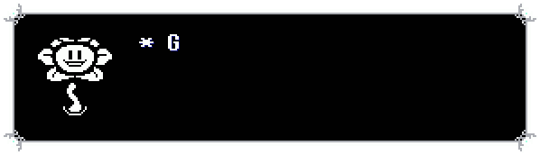
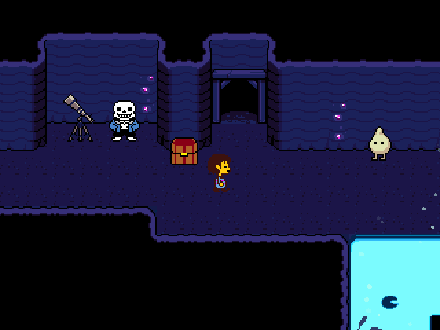

# UndertaleDumpTool

(seeing such a totally illicit and immoral tool fills you with CONSTERNATION.)

Heya. I heard you like modding GameMaker games like Undertale/Deltarune but are awful tired of using an IDE built on the default Visual Studio Windows Forms fucking designer. Well my good buddy, you just might be in luck.

# Woah! Hold up there "Pall!"
This is a work in progress and a personal project of mine. I'm just working on this on my own time for fun. If you have a problem with it, well, for the sake of retaining public professionality I can't quite tell you where to stick it.

# Main Features

* Everything UndertaleModTool can do
* More

# Screenshots
Undertale
## UNDERTALE

Undertale

# Contributing
No?

# Special thanks
* Me
* [x69dbg](https://x64dbg.ru/)
* Robert Ford Fox (usernames "Toby Fox", "FwugRadiation"), son of Robert Fox and Barbara Fox, who lives in Manchester, New Hampshire, is around 30 years of age, was raised Episcopalian and is the creator, developer, programmer, artist, writer and musician for the videogames Undertale and Deltarune, inspired by Final Fantasy VI, EarthBound, Secret of Mana, Super Mario RPG, Live A Live, Touhou, Homestuck and more[[1]](https://en.wikipedia.org/wiki/Toby_Fox)

as well as all the other contributors:              

Oh, right.
